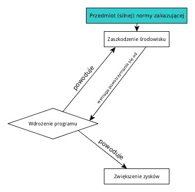
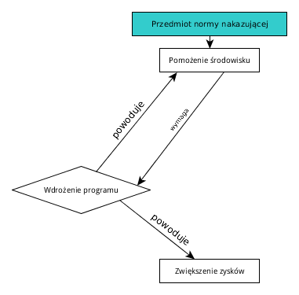

# Efekt Knobe'a, zaniechania i konflikt norm.

## Wstęp Eksperyment Knobe'a (2003) jest jednym z najszerzej obecnie dyskutowanych wyników
filozofii eksperymentalnej. Dla wielu myślicieli zajmujących się teorią działania wyniki
uzyskane przez Knobe'a były sporym zaskoczeniem. Okazało się, że znaczna cześć koncepcji
dotyczących działania intencjonalnego pozostaje w sprzeczności z tym, jak według Knobe'a
używają tego pojęcia użytkownicy języka.

 Samo badanie Knobe'a referowane i komentowane jest w niemal każdym artykule poświęconym
 filozofii eskeprymentalnej, ograniczymy się zatem do jedynie niezbędnych szczegółów.

Oryginalne badanie przeprowadzone zostało na grupie 78 przypadkowych osób przechadzających
się po parku na Manhattanie. Zostali podzieleni na dwie grupy, z których każda skonfrontowana
została z jednym z dwóch scenariuszy.

> ##### Scenariusz HARM

>Wicedyrektor zwraca się do dyrektora pewnej firmy:++++

>„Myślimy o wdrożeniu nowego programu. Pozwoli nam zwiększyć zyski, ale zaszkodzi
środowisku”.

>Dyrektor odpowiada: „Nie obchodzi mnie szkodzenie środowisku. Chcę tylko zwiększyć
zyski. Wdrażamy program”.

>Program został wdrożony i rzeczywiście zaszkodził środowisku.

> ##### Scenariusz HELP

> Wicedyrektor zwraca się do dyrektora pewnej firmy:

>„Myślimy o wdrożeniu nowego programu. Pozwoli nam zwiększyć zyski i pomoże środowisku”.

>Dyrektor odpowiada:

>„Nie obchodzi mnie pomaganie środowisku. Chcę tylko zwiększyć zyski. Wdrażamy program”.

>Program został wdrożony i rzeczywiście pomógł środowisku.

Scenariusze różnatom editor spellingią się od siebie wyłącznie jednym elementem. W
scenariuszu HARM skutkiem ubocznym wdrożenia programu jest zaszkodzenie środowisku, podczas
gdy w scenariuszu HELP skutek jest dla środowiska pozytywny. Skonfrontowani z tymi scenariuszami
badani odpowiadali na pytanie:

> Czy dyrektor intencjonalnie (*intentionally*) zaszkodził/pomógł środowisku?

Wyniki były zaskakujące. Przeważająca większość badanych, którym przedstawiono scenariusz
w wersji HARM odpowiedziała, że dyrektor intencjonalnie zaszkodził środowisku. W przypadku
drugiej wersji scenariusza proporcja była odwrotna - respondenci uważali, że dyrektor nie
pomógł środowisku intencjonalnie. W jaki sposób wyjaśnić tę asymetrię?

Filozofów próbujących zmierzyć się z uzyskanym przez Knobe'a i badaczy replikujących
oryginalne badanie wynikiem można podzielić z grubsza na trzy grupy. Do pierwszej grupy możemy
zaliczać tych myślicieli, którzy efekt Knobe'a, bo tak została nazwana odkryta przez niego
asymetria, próbowali sprowadzić do artefaktu wynikającego ze złej konstrukcji scenariusza,
niezrozumienia pytania przez badanych lub pewnych stereotypów związanych ze specyficznym
enwironmentalistyczno-korporacyjny entouragem scenariuszy Knobe'a. W drugiej grupie znajdują
się filozofowie, którzy nie negują wprawdzie tego, że oryginalny eksperyment coś pokazuje,
ale twierdzą, że można łatwo wyjaśnić wynik uzyskany przez Knobe'a za pomocą zjawisk już
dobrze zrozumianych - na przykład implikatur konwersacyjnych. Trzecia grupa, do której zalicza
się sam Knobe, stoi na stanowisku, że efekt Knobe'a związany jest z jakimś niedostrzeżonym
wcześniej mechanizmem psychologicznym, który wiąże przypisywanie intencjonalności działaniom
z ich moralną oceną.

## Zaniechanowie wyjaśnienie efektu Knobe'a

Zaproponowane przez Paprzycką wyjaśnienie efektu Knobe'a jest propozycją, którą
zakwalifikować możemy do grupy drugiej. Koncepcja ta opiera się na normatywnej koncepcji
zaniechań. Jej dwie podstawowe tezy to:

1. (*zaniechanie*) x dopuszcza się zaniechania (obowiązku moralnego, prawnego etc.) fi-owania
dokładnie wtedy, gdy: (a) fi-owanie jest (moralnym, prawnym etc.) obowiązkiem x-a (bądź
rozsądnie jest oczekiwać od x-a, by fi-ował).  (b) fi-owanie jest w mocy x-a, (c) nie jest
prawdą, że x fi-uje,

2. (*intencjonalne zaniechanie*) x dopuszcza się intencjonalnego zaniechania fi-owania wtedy
i tylko wtedy, gdy:

(0) x dopuszcza się zaniechania -owania oraz (a’) x wie*, że fi-owanie jest jego
obowiązkiem (bądź przedmiotem roz- sądnych oczekiwań), (b’) x wie*, że fi-owanie leży
w jego mocy, (c’) x wie*, że nie fi-uje,

Koncepcja ta służy Paprzyckiej do wyjaśnienia efektu Kobe'a. Stwierdza ona, że w oryginalnym
Knobowskim scenariuszu HARM dyrektor dopuszcza się intencjonalnego zaniechania, ponieważ badani
uważają normę nakazującą nie-szkodzenie środowisku za obowiązującą. W związku z tym
wyprowadzają wniosek, że dyrektor dopuścił się intencjonalnego zaniechania nie-szkodzenia
środowisku (dyrektor intencjonalnie nie nie-szkodził), a zatem po usunięciu podwójnej negacji,
intencjonalnie mu zaszkodził.

Wyjaśnienie to ma wiele zalet. Jest stosunkowo proste, odwołuje się do nieskomplikowanego
mechanizmu intencjonalnych zaniechań, które postulowane były w literaturze poświęconej
filozofii działania od dłuższego czasu. Kwestiami problematycznymi jest jednak to, jak rozumieć
pojęcie "normy". Chcielibyśmy zaproponować eksperyment, którego celem jest sprawdzenie
hipotezy Paprzyckiej, oparty na pewnym wybranym przez nas rozumieniu tego pojęcia. Jest to
koncepcja normy szczególnie popularna wśród teoretyków i filozofów prawa jak również
niektórych deontologów. Koncepcja ta, przy założeniu że jest to intuicyjne pojęcie normy
którym posługują się użytkownicy języka, pozwoliła nam wyprowadzić z hipotezy Paprzyckiej
empiryczne konsekwencje.

Pytanie które należy zadać brzmi - czy istnieją jakiekolwiek empiryczne konsekwencje koncepcji
Paprzyckiej, które odróżniają ją od teorii w rodzaju tej zaproponowanej przez Knobe'a. Oba
te stanowiska są wyjaśnienieniami rezultatów uzyskanych przez Knobe'a i aby rozstrzygnąć,
które z nich jest prawdziwe, koniecznym jest zaproponowanie eksperymentu, którego rezultat
przewidywałyby w sposób odmienny.

## Normy

Normatywna koncepcja zaniechań odwołuje się do pojęcia "normy" oraz pojęcia "rozsądnego
oczekiwania". Skonstruowanie badania, które mogłoby potwierdzić bądź podważyć wyjaśnienie
efektu Knobe'a oparte na tej koncepcji musi doprecyzować te terminy w taki sposób, aby
umożliwić skonstruowanie odpowiedniego narzędzia badawczego. Nie chcąc rozstrzygać
filozoficznego sporu co do natury norm, postanowiliśmy ograniczyć się do przyjęcia kilku
założeń dotyczących zachowania norm. Chcielibyśmy zaznaczyć, że charakterystyka norm,
którą proponujemy nie wiąże się z bardzo mocnymi zobowiązaniami filozoficznymi. Pojęcie
"normy" traktujemy bowiem instrumentalnie, jako pewnego rodzaju narzędzie, które posłużyć
może do opisu sytuacji, w których ludzkie zachowania mają realny wymiar. Nie twierdzimy przy
tym, że istnieją w rzeczwistości jakieś byty, które byłyby normami, że istnieje jakaś
władza poznawcza umożliwiająca ich poznanie ani nawet, że domniemane normy są kauzalnie
efektywne, tzn. że są rzeczywiście współprzyczynami pewnych ludzkich zachowań. Uważamy,
że niezależnie od filozoficznego stanowiska dotyczącego kwestii norm można posługiwać
się tym pojęciem opisując pewną klasę sytuacji.

Do konstrukcji naszego narzędzia badawczego posłużyliśmy się dwoma założeniami:

 1. Normy uporządkowane są w pewne hierarchie, na gruncie których konflikty norm są łatwo
 rozstrzygalne.  2. Istnieją pewne reguły wnioskowania, które pozwalają wyprowadzać wniosek
 o obowiązywaniu jednych norm z przesłanek, stwierdzających obowiązywanie innych.

### Konflikt norm i hierarchiczność systemu norm

W konstrukcji naszego badania kluczową rolę odgrywa zjawisko. które określamy jako "konflikt
norm". Sformułowanie to jest jednak dwuznaczne i może odnosić się do dwóch rodzajów
sytuacji, które mimo pewnych podobieństw różnią się od siebie istotnie.

W pierwszym znaczeniu, które możemy określić znaczeniem "Antygonicznym", "konflikt" norm
odnosi się do sytuacji, w których zastosowanie znajdują dwie wykluczające się w praktyce
normy. Mogą być one tego samego typu (moralne, prawne, społeczne) lub pochodzić z róznych
porządków. "Antygoniczność" takiego konfliktu norm osadza się na tym, że nie istnieje
żadno kryterium, pozwalające rozstrzygnąć, którą z nich należy wcielić w życie. W
przypadku norm tego samego typu ma to miejsce wówczas, gdy są one na tym samym poziomie,
to znaczy mają porównywalną ze sobą wagę. Jeżeli zaś pochodzą z różnych porządków,
to konflikt taki występuje, jeżeli nie da się w sposób oczywisty określić, który z nich
jest porządkiem ważniejszym. Ten rodzaj konfliktu norm egzamplifikuje sytuacja Antygony w
tragedii Sofoklesa. Musiała ona wybrać pomiędzy dwoma wykluczajacymi się normami - jedną
normą prawną, zakazującą pochowania brata i drugą normą natury religijnej, nakładającą
na nią obowiązek pochówku.

Drugie znaczenie sformułowania "konflikt norm" można określić jako "niegroźny konflikt". Z
takim rodzajem konfliktu norm mamy do czynienia wówczas, gdy - w przeciwieństwie do konfliktu
norm typu "Antygonicznego" - istnieje albo oczywisty, albo przynajmniej nieproblematyczny sposób
rozstrzygnięcia tego, która z norm jest ważniejsza. Ten sposób myślenia o normach najłatwiej
wytłumaczyć przywołując koncepcję norm kolizyjnych, którą posługują się teoretycy prawa.

W systemach prawnym istnieją pewne mechanizmy radzenia sobie z sytuacjami, w których w
porządku prawnym istnieją jednocześnie dwie niezgodne ze sobą normy. W takiej sytuacji
należy posłużyć się jedną z reguł kolizyjnych. Szczególnie interesującą z punktu
widzenia rozumienia pojęcia normy wykorzystywanego w konstrukcji naszego narzędzia badawczego
jest tzw. hierarchiczna regułą kolizyjna, wyrażana najczęściej przy pomocy łacińskiej
paremii "Lex superior derogat legi inferiori". Systemy prawne charakteryzują się pewną
hierarchicznością. Najwyżej w hierarchi są normy wynikające z aktów prawnych o randze
konstytucyjnej, niżej są umowy międzynarodowe, ustawy, przepisy prawa miejscowego. W praktyce
zdarza się, że z dwóch aktów prawnych znajdujących się na różnych poziomach hierarchii
możemy wywieść dwie wykluczające się normy. Hierarchiczna reguła kolizyjna nakazuje nam
zastosować wówczas tę normę, która znajduję się na wyższym poziomie hierarchii.

Wydaje się, że w podobny sposób można opisać również system norm moralnych. Ich
hierarchia nie jest oczywiście tak jednoznaczna, jak w przypadku systemów prawnych, należy
jednak zauważyć, że nie wszystkim normom moralnym przypisujemy taką samą wagę. Pomimo
obowiązywania normy, zakazującej kradzieży, jesteśmy skłonni przyznać, że jest ona w jakiś
sposób dopuszczalna, gdy mówimy o kradzieży bułki w sklepie w celu nakarmienia umierającego,
głodnego dziecka. Norma mówiąca "ratuj życie innych ludzi" jest ważniejsza niż ta mówiaca
"nie kradnij".

Uważamy, że istnieje dość możliwość dość określenia metodami empirycznymi
przynajmniej niektórych elementów tak rozumianej hierarchii norm w danym społeczeństwie. Nie
przeprowadziliśmy wprawdzie odpowiednich badań, ale do naszego eksperymentu wybraliśmy takie
normy, dla których ich hierarchiczne usytuowanie nie wydaje się problematyczne.

### Reguły inferencyjne Drugim nasze założenie odnoszące się do norm mówi, że istnieją
pewne reguły wnioskowania o obowiazywaniu jednych norm z obowiązywania innych przy założeniu
określonych związków przyczynowych pomiędzy zachowaniem adresata danej normy  a stanem rzeczy,
którego zrealizowanie norma nakazuje. Źródłem tego pojęcia jest znów teoria prawa, co nie
powinno dziwić, ponieważ problematyka norm jest jednym z podstawowych zagadnień. Reguły te
nazywać będziemy intrumentalnymi regułami inferencyjnymi.

Aby ilustrować z jakiego rodzaju wnioskowaniami mamy do czynienia, chcielibyśmy przedstawić
dwie często przywoływane w literaturze reguły [przypis].

**Reguła instrumentalnego nakazu**: **Przesłanka I**: Obowiązuje    norma    prawna    N1
nakazująca    adresatom    A,    w okolicznościach O, czynić X **Przesłanka II**: spełnienie
(podjęcie   działania)   Y   jest   przyczynowo   konieczne   do spełnienia X **Wniosek**:
obowiązuje też norma prawna N2 nakazująca czynić Y (spełnić Y)

**PRZYKŁAD** Jeżeli  lekarz  ma  obowiązek  ratowania życia  pacjenta  (przesłanka  I),  a
w  danej  sytuacji do  osiągnięcia  tego  celu  konieczne  jest  podanie  określonych  leków
(przesłanka II),  to należy przyjąć, że lekarz ma obowiązek podania tych leków (wniosek).

**Reguła instrumentalnego zakazu** **Przesłanka I**: obowiązuje norma prawna N1 nakazująca
adresatom A, w okolicznościach O, czynić X **Przesłanka II**: spełnienie Z uniemożliwia
osiągnięcie X **Wniosek**: obowiązuje norma prawna N3 zakazująca czynienia Z

**PRZYKŁAD** Jeżeli  strażnik  (pracownik  ochrony)  ma  obowiązek  strzeżenia  (ochrony)
danego   obiektu   (przesłanka   I),   sen   albo   oddalenie   się od   chronionego   obiektu
uniemożliwiająjego ochronę (przesłanka II), to strażnikowi nie wolno spać lub oddalać
się w trakcie zmiany od tegoż obiektu.

Dostrzegamy pewną filozoficzną problematyczność takiego myślenia o normach, uważamy jednak,
że jest to użyteczna koncepcja, która oddaje dobrze potoczne intuicje na temat norm oraz
wnioskowania o nich.

### Analiza oryginalnych scenariuszy Knobe'a

#### Scenariusz HARM 

#### Scenariusz HELP 

Przyjmując istnienie instrumentalnych reguł inferencyjnych spróbujmy przeanalizować sytuacje
kauzalno - normatywną w scenariuszach użytych w oryginalnym eksperymencie Knobe'a.

Relacje przyczynowe i normatywne zilustrowane są za pomocą powyższch diagramów.

W scenariuszu HARM wdrożenie programu przez dyrektora ma dwa skutki. Skutkiem głównym
jest zwiększenie zysków przedsiębiorstwa. Skutek uboczny to wyrządzenie szkody
środowisku. Obowiązująca norma, do której powinien zastosować się dyrektor mówi:
"nie szkódź środowisku". Posługując się regułą instrumentalnego zakazu możemy z tego
faktu wywnioskować, że w okolicznościach przedstawionych w scenariuszu obowiazuje również
norma mówiąca: "nie wdrażaj programu", ponieważ podjęcie działania, jakim jest wdrożenie
programu, uniemożliwia osiagnięcie wyznaczonego przez normę zakazującą szkodzenia środowisku
skutku. W scenariuszu HELP sytuacja wygląda analogicznie. Odpowiednio obowiązuje norma
nakazująca pomaganie środowisku, z której za pomocą reguły inferencyjnej instrumentalnego
nakazu możemy wywieść wniosek o obowiązywaniu normy nakazującej wprowadzenie programu.

## Narzędzie badawcze Naszym celem było skonstruowanie takiego narzędzia badawczego, które
pozwoli nam posługując się przyjętymi załozeniami teoretycznymi sprawdzić trafność hipotezy
wyjaśniającej Paprzyckiej. Postanowiliśmy jako narzędziem posłużyć się podobnie jak
Knobe badaniem ankietowym. Jednym z wymagań jakie postawiliśmy scenariuszom badawczym było
to, żeby jak najmniej rózniły się od oryginalnych scenariuszy Knobowskich. Racją, jaka
stoi za tym założeniem jest to, że im bardziej są do nich podobne, tym bardziej uzasadnione
pod względem metodologicznym jest porównywanie uzyskanych wyników. Celem, jaki przed sobą
stawialiśmy było skonstruowanie takich scenariuszy badawczych, w których:

 * moglibyśmy kontrolować obowiązywanie norm, w szczególności obowiązywanie normy
 zakazującej szkodzenia środowisku * moglibyśmy kontrolować zachowanie podmiotu dziającego
 (dyrektora), w szczególności to, czy jest podmiotem zaniechania obowiązku.

Uznaliśmy, że najskuteczniejszą drogą osiągnięcia tych celów jest skonstruowanie takich
scenariuszy badawczych, w których obok normy zakazującej szkodzenia środowisku lub normy
nakazującej pomaganie mu, obowiązuje także w sposób oczywisty hierarchicznie wyższa norma,
której zrealizowanie pozostaje w związku z niezastosowaniem się do normy hierarchicznie
niższej. Zgodnie z naszymi założeniami w takiej sytuacji konfliktu górę musi wziąć
obowiązek zastosowania się do normy silniejszej, z którego za pomocą reguły instrumentalnego
nakazu wywnioskować może obowiązek takiego działania, które byłoby pogwałceniem normy
hierarchicznie niższej. Z drugiej strony wykorzystaliśmy fakt, że wyjaśnienie Paprzyckiej
jest wyjaśnieniem w kategorii zaniechać. Za pomocą wprowadzenia hierarchicznie wyższej
normy chcieliśmy skonstruować taką sytuację, w której z obowiązku zastosowania się do
hierarchicznie wyższej normy instrumentalnie wynikałyby:

 * w scenariuszu **HARM**  obowiązek wprowadzenia programu, którego jednym ze skutków jest
 zaszkodzenie środowisku, którego zaś skutkiem jest pomożenie ludziom * w scenariuszu
 **HELP**  obowiązek powstrzymania się od wprowadzenia programu, którego jednym ze skutków
 jest pomożenie środowisku środowisku, którego zaś skutkiem jest zaszkodznie ludziom

Każdy z tych scenariuszy przygotowany został w dwóch wersjach - w takiej, w której dyrektor
wprowadza program, więc w **HARM** mamy do czynienia ze spełnieniem obowiązku, w **HELP** zaś
z zaniechaniem, oraz w takiej, w której dyrektor powstrzymuje się od wprowadzenia programu,
gdzie sytuacja wygląda odwrotnie.

Jako normy, która posłużyć nam miała do skonstruowania odpowiedniego narzędzia badawczego
wybraliśmy normę zakazującą narażania ludzi na śmiertelne niebezpieczeństwo oraz normę
nakazującą ratowanie ludzi w sytuacji takiego bezpieczeństwa. Wydaje się, że w naszej
kulturze dla większości ludzi życie ludzkie ma większą wartość niż środowisko. Być
może w przyszłości się to zmieni, jesteśmy jednak przekonani że obecnie niewiele osób
poświęciłoby swoje życie lub zdrowie dla ratowania środowiska, a jeszcze mniej uważałoby,
że należy poświęcić życie innych.

Strukturę kauzalno - normatywną skonstruowanych przez nas scenariuszy przedstawiają poniższe
diagramy, analiza pod względem występowania zaniechań znajduje się w tabeli.

#### Scenariusz HARM 

#### Scenariusz HELP 

|					    |				     HARM
|				       HELP					 |
| ----------------------------------------- |
------------------------------------------------------------------ |
------------------------------------------------------------------------------
| | **Norma znoszona**			      | Nie szkódź środowisku
| Pomagaj środowisku								  |
| **Norma znosząca**			     | Ratuj od śmierci głodowej
| Ratuj od śmierci głodowej							   |
| **Obowiązek prezesa**		     | Ratować od śmierci głodowej, szkodząc
środisku i wdrażając program | Ratować od śmierci głodowej, nie pomagająć środowisku i
nie wdrażając programu | | **Działanie prezesa**			| *Wdrozenie programu,
zaszkodzenie środowisku, uratowanie ludzi*    | *Wdrozenie programu, pomożenie środowisku,
narażenie ludzi na śmierć głodową*  | | **Zadawane pytania:**		       |
|										 | |
**Pytanie o środowisko**		   | Czy dyrektor umyślnie zaszkodził środowisku?
| Czy dyrektor umyślnie pomógł środowisku?					     |
| **Pytanie o życie mieszkańców:**	       | Czy dyrektor umyślnie zapobiegł
śmierci głodowej?		     | Czy dyrektor umyślnie naraził mieszkańców na
śmierć głodową?		      | | **Spełnienie obowiązku czy zaniechanie?** |
Spełnienie obowiązku						     | Zaniechanie obowiązku
|

|					    |				       HARM'
|				      HELP'					 |
|-------------------------------------------|--------------------------------------------------------------------------|--------------------------------------------------------------------------------|
| **Norma znoszona**			    | Nie szkódź środowisku
| Pomagaj środowisku								  |
| **Norma znosząca**			     | Ratuj od śmierci głodowej
| Ratuj od śmierci głodowej							   | |
**Obowiązek prezesa**			   | Ratować od śmierci głodowej, szkodząc środisku
i wdrażając program	    | Ratować od śmierci głodowej, nie pomagająć środowisku i nie
wdrażając programu | | **Działanie prezesa**			    | *Niewdrożenie programu,
niezaszkodzenie środowisku, nieuratowanie ludzi* | *Niewdrożenie programu, niepomożenie
środowisku, uratowanie ludzi*		   | | **Zadawane pytania:**			 |
|										 | | **Pytanie
o środowisko**			 | Czy dyrektor umyślnie nie zaszkodził środowisku?
| Czy dyrektor umyślnie pomógł środowisku?					     |
| **Pytanie o życie mieszkańców:**	       | Czy dyrektor umyślnie  naraził na
śmierć głodową?			   | Czy dyrektor umyślnie zapobiegł śmierci
głodowej?				| | **Spełnienie obowiązku czy zaniechanie?**
| Zaniechanie obowiązku						    | Spełnienie
obowiązku							     |

## Badanie Scenariusze badawcze, które użyte zostały w ostatecznej wersji badania, znajdują
się w Dodatku. Ankieta przeprowadzana została na uniwersyteckiej internetowej platformie
do przeprowadzania badań ankietowych Kognilab, opartej na otwartoźródłowym systemie
LimeSurvey. Uczestnikami byli ochotnicy. W badaniu wzięło udział 241 osób (18.8.2015),
którzy zostali przypisani losowo do czterech grup, z  których każda dostała inny scenariusz. Z
powodu losowości liczba osób w każdej grupie różniła się nieznacznie.

Każdemu badanemu do scenariusza zostały przedstawione w losowej kolejności dwa pytania tak,
że odpowiadając na nie badany zawsze widział scenariusz, nie miał jednak możliwości
powrotu do poprzedniego pytania. Czas na odpowiedź nie był ograniczany.

## Wyniki

#### Czy dyrektor umyślnie (nie) zaszkodził/pomógł środowisku?  

|		 |   HARM  |   HELP  | |----------------|---------|---------| |		       |
Tak/Nie | Tak/Nie | | Działanie      | 43/19	| 11/61   | | Brak działania | 8/34	| 34/32   |

#### Czy dyrektor umyślnie (nie) uratował/naraził na śmierć głodową mieszkańców?

|		 |   HARM  |   HELP  | |----------------|---------|---------| |		       |
Tak/Nie | Tak/Nie | | Działanie      | 10/52	| 55/17   | | Brak działania | 19/23	| 14/52   |

## Dyskusja Uzyskane przez nas wyniki stawiają problem efektu Knobe'a w nowym, interesującym
świetle. Rozważając wyniki badania z użyciem naszej wersji scenariuszów HARM i HELP
należy zauważyć, że jeżeli chodzi o "bliższy" skutek uboczny, to asymetria w przypisywaniu
dyrektorowi asymetrii była tak samo silna, jeśli nie silniejsza, jak w oryginalnych scenariuszach
Knobe'a.

Stało się to pomimo tego, że szkodzenie i pomaganie środowisku przyjęło formę
skonkretyzowaną, tzn. nie zostało określone jedynie za pomocą ogólnych określeń "szkodzenia"
i "pomagania", ale zostały również opisane dość uchwytne skutki wprowadzenia programu dla
środowiska. W kontekście eksperymentu Knobe'a podnosiły się głosy mówiące, że kwestia
ta może mieć znaczenie dla występowania asymetrii. Kolejny raz zostało jednak potwierdzone,
że nie ma to większego znaczenia.

Okazuje się również, że obecność "dalszego" skutku, to znaczy skutku dodanego przez nas
związanego ze śmiercią głodową również nie wpływa na rozmiar i kształt asymetrii. Wbrew
przewidywaniom zintepretowanego przez nas zaniechaniowego wyjaśnienia efektu Knobe'a
nie nastąpiło odwrócenie stosunku respodentów przypisujących zaszkodzeniu środowisku
dyrektorowa intencjonalność w skutek "odwrócenia" normy zakazującej szkodzić środowisku i
transformacji jej w normę wyrażającą nakaz czynienia tego jako środka do uratowania ludzi
od śmierci głodowej.

Z drugiej strony pytani o intencjonalność dalszego skutku - zaszkodzenia i pomożenia ludziom -
badani odpowiadają zgodnie z dobrze już znanym kluczem, niezależnie od faktu, że jest to skutek
"dalszy" - skutek skutku ubocznego. Asymetria jest ma taką samą siłę jak w przypadku skutku
ubocznego, mimo znacznego oddalenia w ciągu przyczynowym, który zapoczątkowuje działanie
dyrektora, jakim jest wprowadzenie programu.

W drugiej parze scenariuszów, w której dyrektor nie wprowadził programu, wyniki są jeszcze
bardziej interesujące. W przypadkach, w których zadajemy ankietowanym pytanie o przypisanie
intencjonalności dyrektorowi w przypadku pozytywnego moralnie skutku jego działania - zarówno
"bliższego" (dotyczącego środowiska w HARM') jak i dalszego (dotyczącego śmierci ludzi w
HELP') - wyniki nie odbiegają od tego, czego byśmy się spodziewali. Badani w przeważającej
większości nie przypisują działaniu dyrektora polegającym na nieszkodzeniu środowisku
oraz nieszkodzeniu ludziom intencjonalności.

Frapujące są jednak odpowiedzi badanych wówczas, gdy pytamy o przypisanie intencjonalności
w kontekście jakiegoś negatywnego skutku działania dyrektora. Poziom akceptacji twierdzenia
mówiacego, że dyrektor intencjonalnie nie pomógł środowisku bądź nie uratował ludzi od
śmierci głodowej w scenariuszach, w których program nie został wprowadzony, jest inny niż
w drugiej parze scenariuszy.

Na wynik ten można patrzeć na kilka sposób. Po pierwsze, można rozpatrywać go z
perspektywy intencjonalności zaniechań. Należy bowiem przypomnieć, że w scenariuszach
HARM' oraz HELP' mamy do czynienia z "czystymi" zaniechaniami. Ich "czystość" polega na
tym, że mamy do czynienia z faktycznym powstrzymaniem się agenta od działania, do którego
był zobowiązany. Na gruncie ortodoksyjnej teorii działania można argumentować, że skutki
intencjonalnego działania dyrektora polegającego na niewprowadzaniu programu w ogóle nie są
działaniami dyrektora. Skoro nie są jego działaniami, to *a fortiori* nie mogą być jego
działaniami intencjonalnymi. Okazuje się jednak, że ponad połowa respondentów przypisuje
dyrektorowi w tych przypadkach intencjonalne sprawstwo. Teoria zaniechań intencjonalnych dobrze
tłumaczy fakt przypisywania intencjonalności w tych sytuacjach - są to po prostu sytuacje
w których mamy do czynienia z	intencjonalny zaniechaniami.

Wyjaśnienie efektu Knobe'a w kategoriach intencjonalnych zaniechań wydaje się zatem kompatybilne
z pewnymi aspektami uzyskanych przez nas rezultatów, z innymi zaś pozostaje niezgodne. Co to
może oznaczać?

Być może jest tak, że nie udało się za pomocą konstrukcji historyjek uzyskać tak przez
nas porządanych sytuacji normatywnych. Dopuszczamy możliwość tego, że nasz plan nie
powiódł się, ponieważ ludzie w rzeczywistości nie przeprowadzają żadnych intuicyjnych
rozumowań na normach oraz nie posługują się regułami kolizyjnymi w sytuacjach konfliktu
norm. Jeżeli tak jednak jest, to trudno w takim razie uchwycić jakiekolwiek filozoficznie
interesujące znaczenie normy, a w szczególności odpowiedzieć na pytanie czym miałaby
być oprócz powszechnego - negatywnego lub pozytywnego - moralnego wartościowania pewnych
rodzajów działań *in abstracto*. Z drugiej zaś strony wyjaśnienie Paprzyckiej jak i teoria
intencjonalnych zaniechań jak się wydaje operuje bardziej wyrafinowanym pojęciem normy.

Chcielibyśmy zapronować szkic teorii, która uzgadniałaby podstawową intuicję idącą
za zaniechaniowym wyjaśnieniem efektu Knobe'a z wynikami przeprowadzonego przez nas
eksperymentu. Jesteśmy przekonani, że na problem Knobe'a należy spojrzeć w inny sposób.

## Zakończenie

## DODATEK I - Scenariusze

### HARM Wicedyrektor zwraca się do dyrektora pewnej firmy: „Rozważamy wdrożenie nowego
programu w naszej fabryce w Azji Południowej. Pozwoli nam pomnożyć zyski, przyczyni się do
pogorszenia stanu środowiska, ale pozwoli walczyć z głodem w regionie.

Ekologowie twierdzą, że wprowadzenie programu uszkodzi wały przeciwpowodziowe i znaczne
tereny zostaną zalane, co spowoduje katastrofę ekologiczną: wyginie wiele unikatowych i
endemicznych roślin. Ich wyginięcie spowoduje jednak, że mieszkańcy będą mogli na tych
terenach zacząć uprawiać ryż, dla wielu z nich będzie to więc oznaczało definitywny
koniec głodu zbierającego co roku śmiertelne żniwo”.

Dyrektor odpowiada: „Rozumiem, że wprowadzenie programu zaszkodzi środowisku, a zaszkodzenie
środowisku uratuje życie wielu osobom. Zupełnie nie obchodzi mnie jednak ani szkodzenie
środowisku, ani życie mieszkańców. Interesują mnie tylko zyski. Wdrażamy program”.

Program został wdrożony. Rzeczywiście, mieszkańcy nie cierpieli głodu, ale ucierpiało
środowisko.

**CZY ZGADZASZ SIĘ ZE STWIERDZENIEM:**

*Dyrektor umyślnie zaszkodził środowisku.*

*Dyrektor umyślnie zapobiegł groźbie śmierci głodowej wśród mieszkańców.*

### HARM' Wicedyrektor zwraca się do dyrektora pewnej firmy: „Rozważamy wdrożenie w naszej
fabryce w Azji Południowej nowego programu. Program narazi nas na straty finansowe, przyczyni
się do pogorszenia stanu środowiska, ale pozwoli walczyć z głodem w regionie.

Ekologowie twierdzą, że wprowadzenie programu uszkodzi wały przeciwpowodziowe i znaczne
tereny zostaną zalane, co spowoduje katastrofę ekologiczną: wyginie wiele unikatowych i
endemicznych roślin. Ich wyginięcie spowoduje jednak, że mieszkańcy będą mogli na tych
terenach zacząć uprawiać ryż, dla wielu z nich będzie to więc oznaczało definitywny
koniec głodu zbierającego co roku śmiertelne żniwo”.

Dyrektor odpowiada: „Rozumiem, że wprowadzenie programu zaszkodzi środowisku, a zaszkodzenie
środowisku uratuje życie wielu osobom. Zupełnie nie obchodzi mnie jednak ani szkodzenie
środowisku, ani życie mieszkańców. Interesują mnie tylko zyski. Nie wdrażamy programu”.

Program nie został wdrożony. Rzeczywiście, część mieszkańców zmarła w wyniku głodu,
środowisko nie ucierpiało.

**CZY ZGADZASZ SIĘ ZE STWIERDZENIEM:**

*Dyrektor umyślnie nie zaszkodził środowisku.*

*Dyrektor umyślnie naraził mieszkańców na śmierć głodową.*

### HELP Wicedyrektor zwraca się do dyrektora pewnej firmy: „Rozważamy wdrożenie nowego
programu w naszej fabryce w Azji Południowej. Pozwoli nam pomnożyć zyski, będzie korzystny
na środowiska, ale przyczyni się do pojawienia się głodu w regionie.

Ekologowie twierdzą, że jednym ze skutków wprowadzenia programu będzie konieczność
wzmocnienia istniejących wałów przeciwpowodziowych. Dzięki temu znaczne tereny przestaną być
rokrocznie zalewane. Gdyby udało się powstrzymać powodzie, udałoby się również zapobiec
postępującej katastrofie ekologicznej: uratowalibyśmy wiele unikatowych i endemicznych
roślin. Dotychczasowa degradacja roślinności pozwala jednak mieszkańcom uprawiać na tych
terenach ryż. Dla wielu rodzin brak katastrofalnych dla środowiska powodzi oznaczałby więc
cierpienie śmiertelnego głodu”.

Dyrektor odpowiada: „Rozumiem, że wprowadzenie programu pomoże środowisku, a to sprowadzi
na mieszkańców groźbę śmierci głodowej. Zupełnie nie obchodzi mnie jednak ani szkodzenie
środowisku, ani cierpienia mieszkańców. Interesują mnie tylko zyski. Wdrażamy program”.

Program został wdrożony. Rzeczywiście, część mieszkańców zmarła w wyniku głodu,
ale program pomógł środowisku.

**CZY ZGADZASZ SIĘ ZE STWIERDZENIEM:**

Dyrektor umyślnie pomógł środowisku.

Dyrektor umyślnie naraził mieszkańców na śmierć głodową.

### HELP'

Wicedyrektor zwraca się do dyrektora pewnej firmy: „Rozważamy wdrożenie w naszej fabryce
w Azji Południowej nowego programu. Program narazi nas na straty finansowe, będzie korzystny
na środowiska, ale przyczyni się do pojawienia się głodu w regionie.

Ekologowie twierdzą, że jednym ze skutków wprowadzenia programu będzie konieczność
wzmocnienia istniejących wałów przeciwpowodziowych. Dzięki temu znaczne tereny przestaną być
rokrocznie zalewane. Gdyby udało się powstrzymać powodzie, udałoby się również zapobiec
postępującej katastrofie ekologicznej: uratowalibyśmy wiele unikatowych i endemicznych
roślin. Dotychczasowa degradacja roślinności pozwala jednak mieszkańcom uprawiać na tych
terenach ryż. Dla wielu rodzin brak katastrofalnych dla środowiska powodzi oznaczałby więc
cierpienie śmiertelnego głodu”.

Dyrektor odpowiada: „Rozumiem, że wprowadzenie programu pomoże środowisku, a to sprowadzi
na mieszkańców groźbę śmierci głodowej. Zupełnie nie obchodzi mnie jednak ani szkodzenie
środowisku, ani cierpienia mieszkańców. Interesują mnie tylko zyski. Nie wdrażamy programu”.

Program nie został wdrożony. Rzeczywiście, mieszkańcy nie cierpieli głodu, ale w szybkim
tempie postępowała degradacja środowiska.

**CZY ZGADZASZ SIĘ ZE STWIERDZENIEM:**

Dyrektor umyślnie nie pomógł środowisku.

Dyrektor umyślnie zapobiegł groźbie śmierci głodowej wśród mieszkańców.

